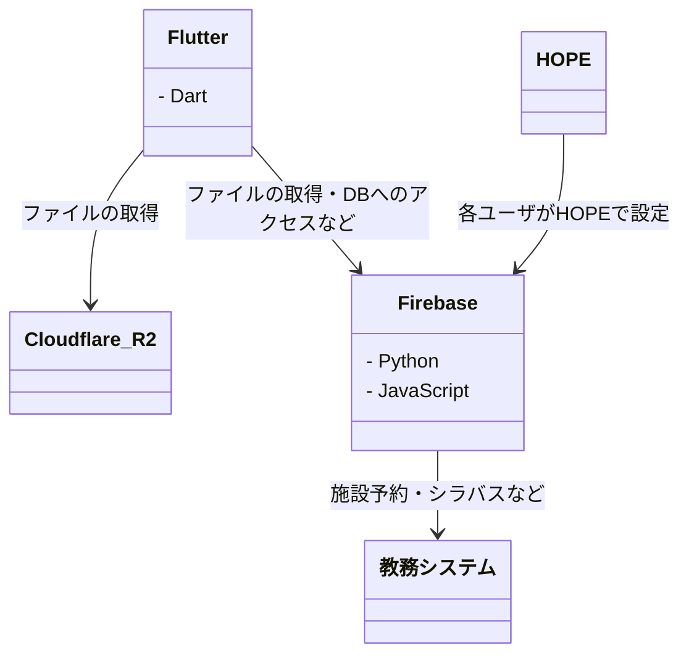

# オンボーディング

## 技術概要

```mermaid
classDiagram
  Flutter --> Cloudflare_R2 : ファイルの取得
  Flutter --> Firebase : ファイルの取得・DBへのアクセスなど
  HOPE --> Firebase : 各ユーザがHOPEで設定
  Firebase --> 教務システム : 施設予約・シラバスなど

  Flutter : - Dart
  Firebase : - Python
  Firebase : - JavaScript
```

## 環境構築

- [GitHub アカウントの作成](setup/01_GitHub.md)
