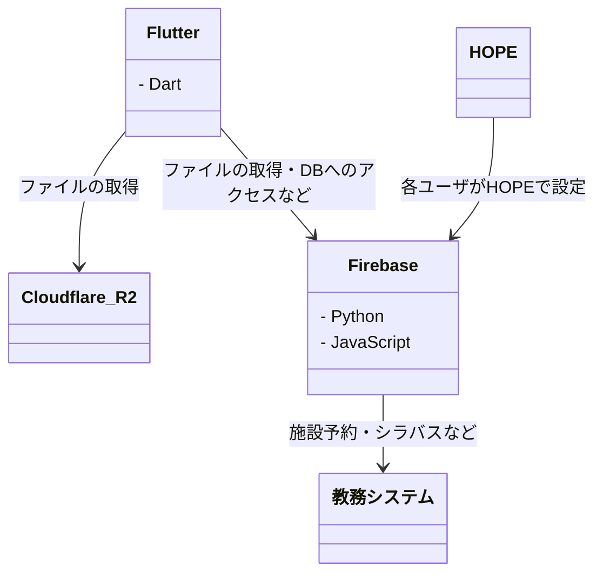

# オンボーディング

## 技術概要

## 環境構築

- [GitHub アカウント](setup/01_GitHub.md)
- [[macOS] Homebrew](setup/02_macOS_Homebrew.md)
- [[Windows] Windows ターミナル](setup/03_Windows_Terminal.md)
- [Visual Studio Code](setup/04_VisualStudioCode.md)
- [[macOS] Xcode](setup/05_Xcode.md)
- Android Studio
- Git
- Flutter
- Firebase
- Dotto
