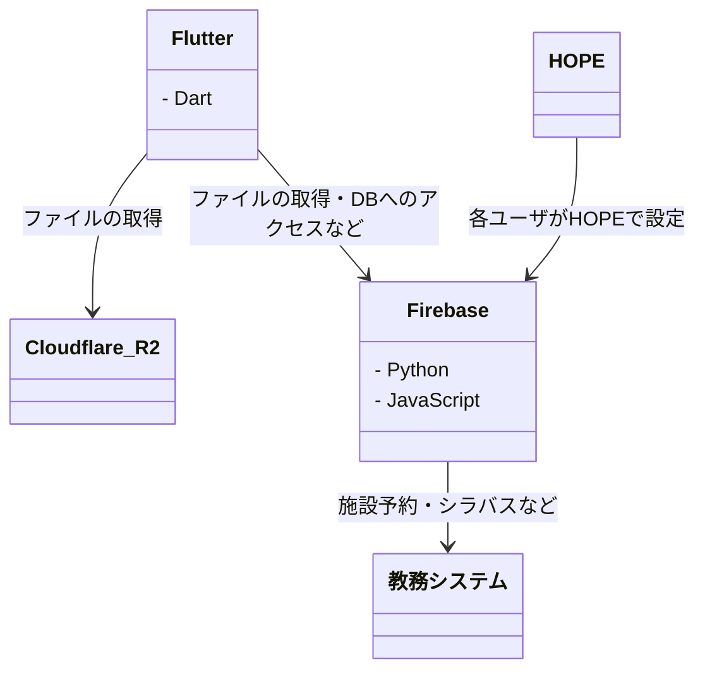

# オンボーディング

## 環境構築

- [パッケージマネージャー](setup/01_PackageManager.md)
- [[Windows] PowerShell](setup/02_WindowsPowerShell.md)
- [Git](setup/03_Git.md)
- [テキストエディタ](setup/04_TextEditor.md)
- [IDE](setup/05_IDE.md)
- [mise](setup/06_Mise.md)
- [Dotto](setup/07_Dotto.md)

## チュートリアル

- [[WIP] Flutter チュートリアル](https://github.com/fun-dotto/tutorial-flutter)

## 技術概要

- [[WIP] システムアーキテクチャ](system/README.md)

### 概要図

## コードベース

- [Feature](codebase/01_Feature.md)
- [アーキテクチャ](codebase/02_Architecture.md)

## リリースフロー

- 毎週木曜日午後 5 時を目安に審査に提出
- 次週月曜日に配信開始

## 開発フロー

- [GitHub Project](development/01_Project.md)
- [Branch](development/02_Branch.md)
- [Commit](development/03_Commit.md)
- [Pull Request](development/04_PR.md)
