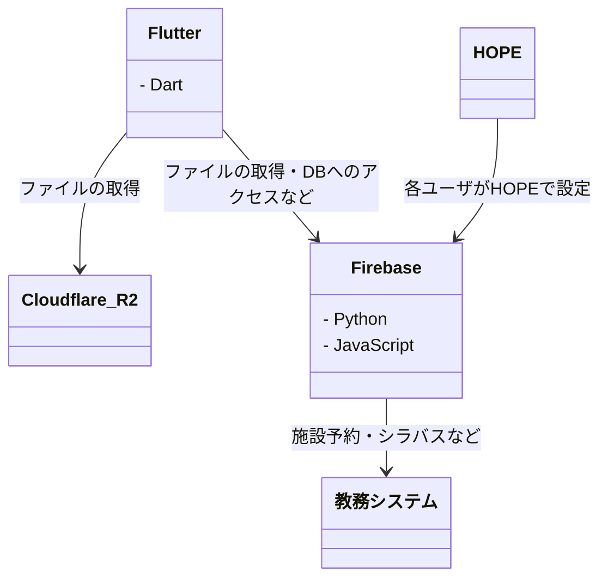

# オンボーディング

## 環境構築

- [GitHub アカウント](setup/01_GitHub.md)
- [[macOS] Homebrew](setup/02_macOS_Homebrew.md)
- [[Windows] Windows ターミナル](setup/03_Windows_Terminal.md)
- [Visual Studio Code](setup/04_VisualStudioCode.md)
- [[macOS] Xcode](setup/05_macOS_Xcode.md)
- [Android Studio](setup/06_AndroidStudio.md)
- [Git](setup/07_Git.md)
- [Flutter](setup/08_Flutter.md)
- [Firebase](setup/09_Firebase.md)
- [Task](setup/10_Task.md)
- [Dotto](setup/11_Dotto.md)

## 技術概要

## コードベース

- [Feature モジュール](codebase/01_Feature.md)
- [アーキテクチャ](codebase/02_Architecture.md)

## リリースフロー

- 毎週木曜日午後 5 時を目安に審査に提出
- 次週月曜日に配信開始

## 開発フロー

- [Project](development/01_Project.md)
- [Branch](development/02_Branch.md)
- [Commit](development/03_Commit.md)
- [Pull Request](development/04_PR.md)
