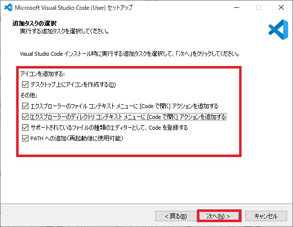

# [Visual Studio Code](https://code.visualstudio.com/)

テキストエディタです。

## [macOS] Visual Studio Code をインストール

Homebrew を使ってインストールします。

```
% brew install --cask visual-studio-code
```

## [Windows] Visual Studio Code をインストール

[公式サイト](https://code.visualstudio.com/)からインストーラをダウンロードしてインストールします。

以下、全てにチェックマークを入れます。



## 拡張機能を追加

左のメニューバーから拡張機能 (英: Extensions) を選択します。  
macOS であれば、⇧⌘X で開くこともできます。

### 必須

- Flutter
- GitHub Pull Requests
- GitHub Copilot

### 任意

- Japanese Language Pack
  - Visual Studio Code を日本語化する
- zenkaku
  - 全角文字をハイライト表示する
- その他好きな拡張機能

## GitHub アカウントでサインイン

設定や拡張機能を同期できるほか、Copilot の上位モデルを使用できるなどのメリットもあるので、おすすめします。

左のメニューバーからアカウント (英: Accounts) を選択します。
