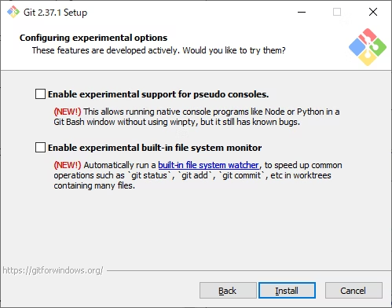

# Git

## [Windows] Git をインストール

[Git for Windows](https://gitforwindows.org)をダウンロードしてインストールします。

<details>
<summary>インストール手順詳細</summary>

- 
- 
  - `Use Visual Studio Code as Git's default editor`を選択
- 
  - `main`
- 
- 

</details>

## Git をセットアップ

[macOS] ターミナル.app を起動します。

[Windows] Windows ターミナルを起動します。

以下のコマンドを実行します。

```
% git config --global user.name "<自分の名前: フルネームを `Given Family` の形式で>"
% git config --global user.email "<メールアドレス: GitHubで登録したものと同一のもの>"
```

## GitHub の SSH を設定

### [macOS] 秘密鍵と公開鍵を生成

```
% mkdir ~/.ssh
% ssh-keygen -t ed25519 -C "<メールアドレス>"
Enter a file in which to save the key (/Users/<username>/.ssh/id_ed25519): /Users/<username>/.ssh/github
Enter passphrase (empty for no passphrase): <Enterキーを押下>
Enter same passphrase again: <Enterキーを押下>
```

### [Windows] 秘密鍵と公開鍵を生成

```
> mkdir ~/.ssh
> ssh-keygen -t ed25519 -C "<メールアドレス>"
Enter a file in which to save the key (C:\Users\<username>\.ssh\id_ed25519): C:\Users\<username>\.ssh\github
Enter passphrase (empty for no passphrase): <Enterキーを押下>
Enter same passphrase again: <Enterキーを押下>
> Get-Service -Name ssh-agent | Set-Service -StartupType Manual
Start-Service ssh-agent
```

### [macOS] SSH Agent に秘密鍵を登録

```
% eval "$(ssh-agent -s)"
% echo "Host github.com
  AddKeysToAgent yes
  UseKeychain yes
  IdentityFile ~/.ssh/github
" >> ~/.ssh/config
% ssh-add --apple-use-keychain ~/.ssh/github
```

### [Windows] SSH Agent に秘密鍵を登録

```
> Get-Service -Name ssh-agent | Set-Service -StartupType Manual
Start-Service ssh-agent
> ssh-add ~/.ssh/github
```

### GitHub に公開鍵を登録

[macOS] 公開鍵をクリップボードにコピーします。

```
% pbcopy < ~/.ssh/github.pub
```

[Windows] 公開鍵をクリップボードにコピーします。

```
> cat ~/.ssh/github.pub | clip
```

[GitHub の SSH キー設定ページ](https://github.com/settings/keys)を開きます。

`New SSH key`を押下します。

`Title`には、コンピュータ名などの名前をつけます。

`Key`に、クリップボードにコピーした公開鍵をペーストします。

`Add SSH key`を押下します。

### 接続確認

以下のコマンドを実行して、表示されれば成功です。

```
% ssh -T git@github.com
Hi <username>! You've successfully authenticated, but GitHub does not provide shell access.
```
