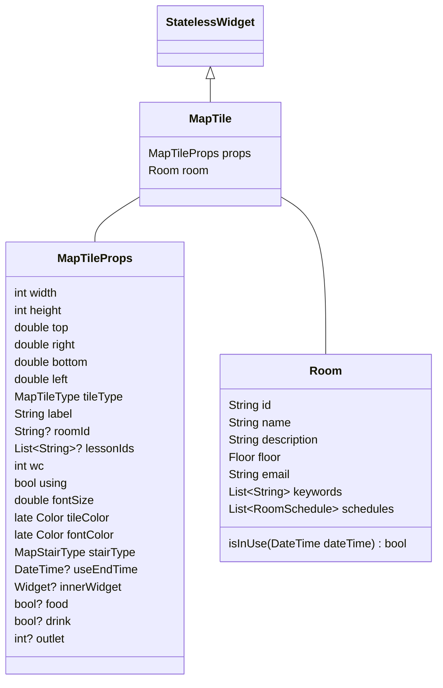

# Map

## MapTile



### TileType

```swift
enum TileType {
    case classRoom(_ roomID: String)
    case facultyRoom(_ roomID: String)
    case subRoom(_ roomID: String)      // TODO: Rename
    case otherRoom(_ roomID: String)    // TODO: Rename
    case restroom(_ type: RestroomType)
    case stair
    case elevator
    case aisle
    case atrium
}

enum RestroomType {
    case men
    case women
    case wheelchair
}
```
